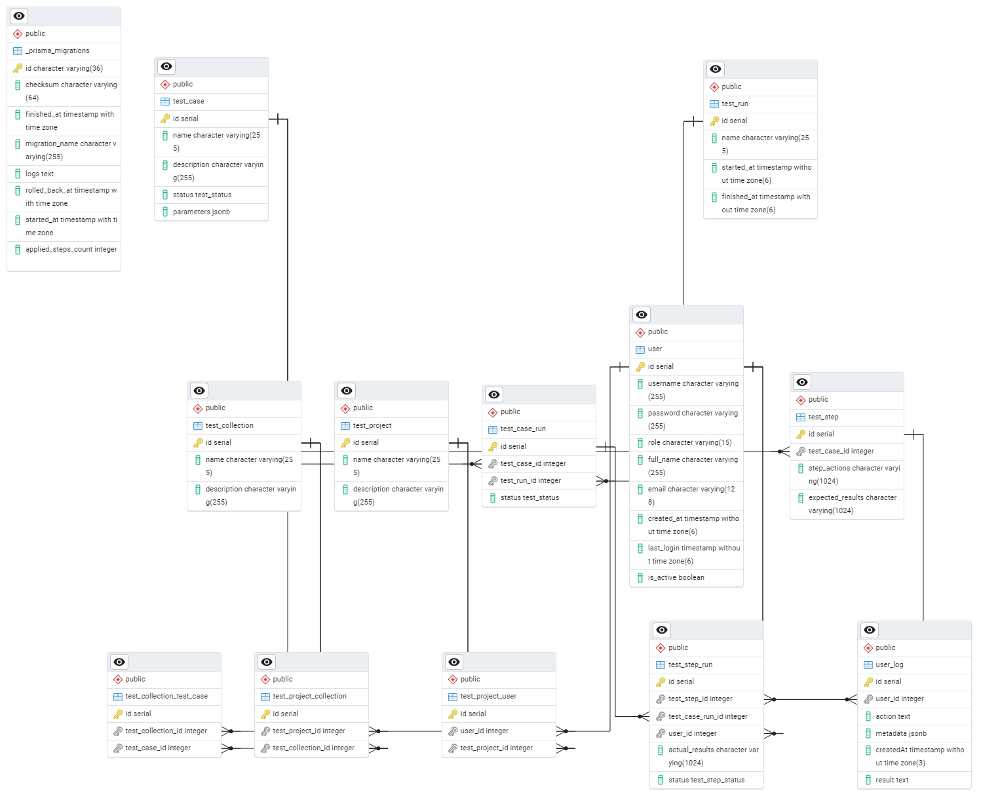

# Requirements
## Why simple test case manager?
Multiple of both open source and enterprise solutions are bloated with features that are overengineered, 
and it seems like they exist purely to confuse everyone - meaning the implementation of a test management software drags out in time, and instead of testing - you write pages upon pages of single-use documents.
Not to mention, enterprise solutions are expensive.

Simple test manager comes with minimal functions, just to get you started with testing:

- Test projects -> global objects, consisting of multiple test suites/test plans
- Test suites -> object that can hold multiple test cases
- Test cases -> encapsulated test steps
  - Test step -> support for markdown, **CHECKLISTS*** images, videos, gifs | statuses
- Test runs -> run either a whole suite, or choose test cases to run within a test run
- Parameterized testing -> create pairwise or full testing matrices for better coverage
- Automation support -> open, documented API - create objects, generate reports, track bugs
- Simple reports -> generate a list of test runs, test cases and their statuses 
- Simple bug tracking -> generate a bug fix request, generate pdf bug report
- JIRA integration
- Import/export - CSV 

\*I **REALLY** like checklists 
## Role based auth
Roles:
- Admin
- Tester
- Test manager?

## Permission management

1. Permissions should be granural - permission matrix

# Object hierarchy
Objects in the system:
1. Test project
2. Test suite (collection of tests)
3. Test case
4. Test run

# Main user flows

## Admin
1. Approve/create accounts
2. Block users (employees no longer in the company - can't delete them to keep the test history intact)
3. Permission management
4. Edit/archive projects
5. View/delete generated reports
6. View statistics

## Tester
CRUD + clone:
1. Test 
   2. project
   3. suite
   4. case
      5. step
   4. run
5. Reports
   6. Test run report
   7. Test case report
   8. Bug report
9. Statistics

## Test manager
1. Set priorities
2. schedule test runs
3. assign test cases/suites/projects to testers
4. oversee reports/statistics -> generate reports for each tester


# Database

PostgreSQL

ER diagram:



update nest packages:
```npm-check-updates "/nestjs*/" -u```